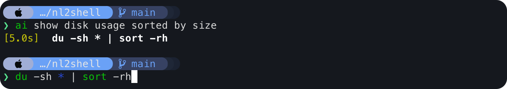

# nl2shell.sh

`nl2shell.sh` converts a natural language request into a single shell command by calling an OpenAI-compatible chat completions API.



## Install In zsh

```bash
git clone https://github.com/haowang02/nl2shell
cd nl2shell
bash ./install.sh
source ~/.zshrc
```

Use it:

```zsh
ai show disk usage sorted by size
```

